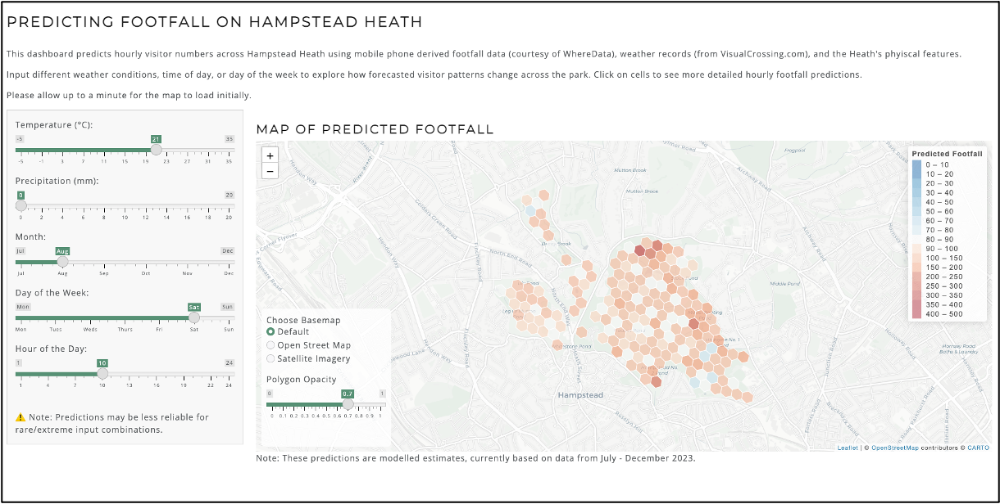
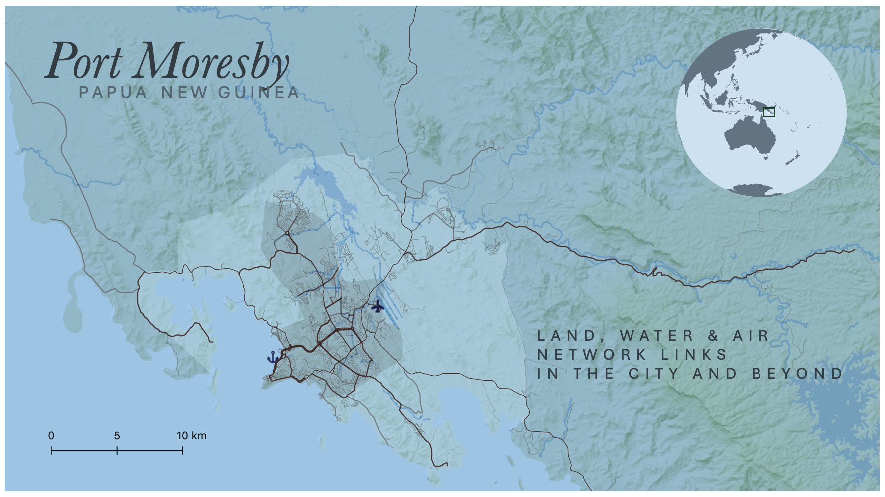

# Geospatial Data Scientist | UCL Geography Graduate 

Welcome to my portfolio, where I’ll be sharing and discussing a few of my key projects. 

I'm driven by tackling complex, real world problems with a range of interdisciplinary skills honed throughout my Geography degree; passionate about blending analytical tools with a touch of design & creativity in order to make sense of the world.

If you're interested, click on a project title to find out more, and visit my GitHub profile to see what else I'm currently working on.

---

## Projects
### [Predicting Footfall on Hampstead Heath](/pages/page_footfall-prediction.md)
Big Data | Random Forest | RShiny Dashboard 

---

### [Recycling or Relocation: The UK's 'Recycled Plastics & Global Ocean Pollution](/pages/page_recycling-or-relocation.md)
GIS | Data Storytelling

---

### [Cartography & Designing Basemaps](/pages/page_cartography.md)
GIS | Cartography & Data Visualisation

---
